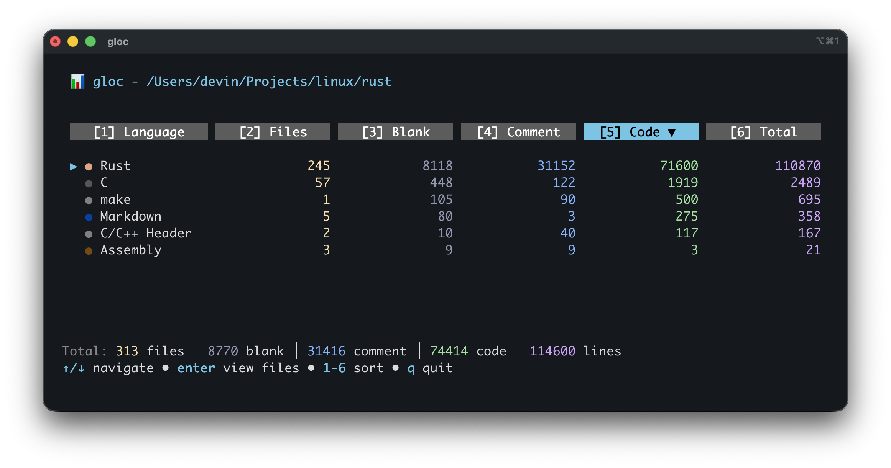
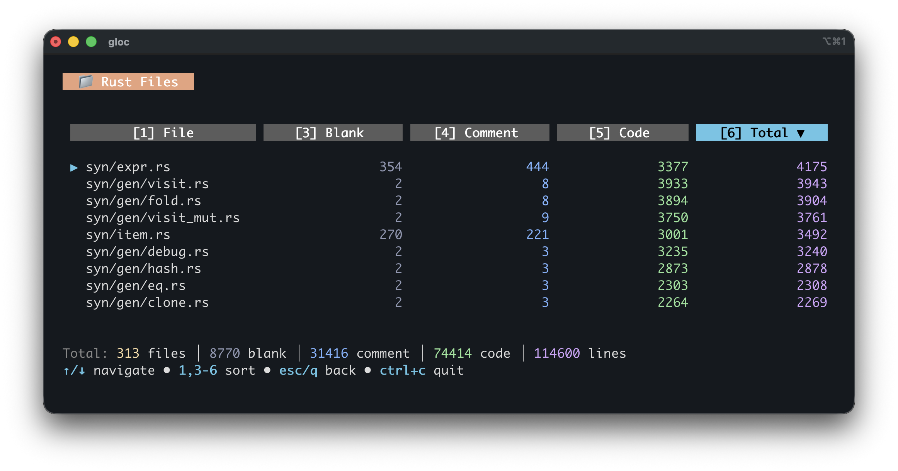

# gloc

A colorful terminal UI for browsing code statistics, powered by [cloc](https://github.com/AlDanial/cloc).





## Install

Requires [cloc](https://github.com/AlDanial/cloc) to be installed.

```
go install github.com/devin/gloc@latest
```

## Usage

```
gloc [path]
```

## Keys

- `↑/↓` or `j/k` - navigate
- `enter` - view files for selected language
- `1-6` - sort by column
- `q` or `esc` - back / quit